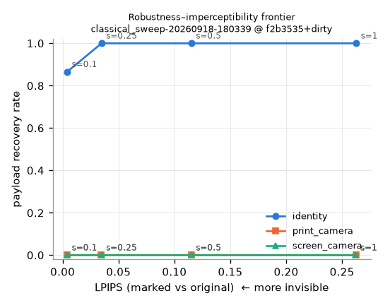
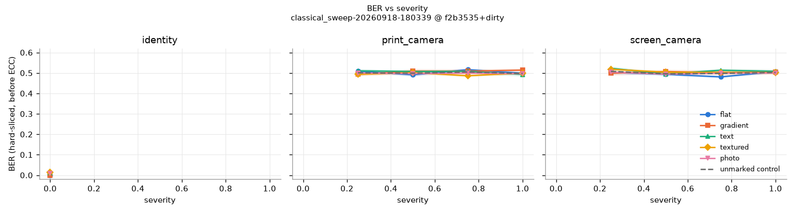

# Week 2 — Classical baseline: where and why it fails

**Status:** complete, 2026-09-18. Runs `classical_sweep-20260918-180339` (4,824 rows) and
`classical_isolated-20260918-180657` (2,412 rows), commit `f2b3535` / `3976395`, RTX 3050.
Configs: `configs/experiments/classical_sweep.yaml`, `classical_isolated.yaml`. Reproducible
with `pm-corpus build --seed 0` → `pm-run <config>` → `pm-plot <run>`.

## TL;DR

The classical DCT spread-spectrum baseline (Cox-style, Watson-budgeted, BCH(127,64)) does what
the brief predicted: **it decodes perfectly on the digital channel and fails completely on both
simulated camera channels at every severity.** The failure is entirely **geometric
synchronisation** — 1° of perspective tilt costs 17 % raw BER, 3° kills payload recovery, and
oracle rectification restores BER 0 — not signal strength. Two further findings the brief did not
anticipate this early:

1. **Flat images fail JPEG alone.** At Watson threshold the mark on a solid fill is smaller than
   the JPEG quantisation step, so it is quantised away at Q75 (33 % BER) while photos survive
   Q25 with 0 % BER. The per-image budget problem shows up in the *digital* channel, not just
   the physical one.
2. **The Watson budget is not an invisibility budget.** One JND per coefficient (`strength = 1`)
   pools to LPIPS 0.44 on flat fills and 0.61 on gradients — grossly visible — versus 0.21 on
   photos. The invisible operating point is `strength ≈ 0.1–0.25`, where photos/text already
   show 3–5 % raw BER from host interference. The robustness–imperceptibility frontier is
   narrow even with no channel at all.

## Setup

| | |
|---|---|
| Marker | `ClassicalSSMarker`: additive SS on all mid-band (u+v ∈ [3,8]) luma DCT coefficients, keyed chip permutation, 127 payload slots + 1 pilot, amplitude = `strength × Watson slack` |
| Budget | Watson 1993 (table + luminance masking a_T 0.649 + contrast masking w 0.7) at 96 DPI @ 60 cm (39.6 px/deg) |
| Detector | blind slack-normalised correlator; per-slot z-score → LLR; pilot z → presence score |
| ECC | BCH(127, 64), t = 10, hard-decision (harness-side) |
| Corpus | 67 images @ 512²: 9 flat, 5 gradient, 5 text, 8 textured (procedural), 40 photo (Kaggle landscapes) |
| Chips | 4,096 blocks × 37 = 151,552 per image → ~1,184 chips/bit (30.7 dB processing gain) |
| Channels | `identity`; `print_camera` / `screen_camera` at severity 0.25–1.0; single-axis `perspective_fixed`, `defocus_fixed`, `jpeg_fixed`, `resize_fixed` |
| Control | every trial repeated unmarked through the identical distortion draw (2,412 + 1,206 rows) |

## 1. Digital channel: it works, and the frontier is narrow

Identity channel, per class × strength (raw BER before ECC, payload recovery after BCH):

| class | s=0.10 BER / rec / LPIPS | s=0.25 | s=0.50 | s=1.0 |
|---|---|---|---|---|
| flat | 0.000 / 1.00 / **0.006** | 0.000 / 1.00 / 0.074 | 0.000 / 1.00 / 0.223 | 0.000 / 1.00 / **0.436** |
| gradient | 0.000 / 1.00 / 0.021 | 0.000 / 1.00 / 0.120 | 0.000 / 1.00 / 0.320 | 0.000 / 1.00 / **0.607** |
| text | 0.043 / 0.80 / 0.001 | 0.003 / 1.00 / 0.008 | 0.000 / 1.00 / 0.035 | 0.000 / 1.00 / 0.121 |
| textured | 0.053 / 0.63 / 0.004 | 0.009 / 1.00 / 0.032 | 0.000 / 1.00 / 0.094 | 0.000 / 1.00 / 0.188 |
| photo | 0.035 / 0.88 / 0.002 | 0.001 / 1.00 / 0.019 | 0.000 / 1.00 / 0.079 | 0.000 / 1.00 / 0.213 |

PSNR at s=1: flat 37.1, gradient 35.2, text 28.9, textured 31.9, photo 31.7 dB.

- **Flat/gradient images have zero host interference** (no AC energy), so BER is 0 at any
  strength — but the mark is pure structured noise on a smooth field and is the *most* visible
  (LPIPS 0.44–0.61 at s=1, already 0.07–0.12 at s=0.25).
- **Textured images mask the mark** (LPIPS 0.19–0.21 at s=1) but host coefficients act as noise
  against the correlator: 3.5–5.3 % raw BER at s=0.1, which BCH t=10 (7.9 %) mostly but not
  always corrects (recovery 0.63–0.88).
- The frontier (`figures/week2_frontier.png`): recovery 1.0 is reached at s=0.25 with LPIPS
  0.008–0.12 depending on class. Whether LPIPS 0.02 (photo) is "indistinguishable" is exactly
  what the Week-4 2AFC study decides; PSNR 43–49 dB at that point is well above StegaStamp's
  29.7 dB, for a channel that does nothing.



## 2. Camera channels: total failure at every severity

`print_camera` and `screen_camera`, strength 1.0, all severities 0.25–1.0:

| chain | sev | raw BER | recovery | AUC (pilot vs control) | TPR @ 1 % FPR |
|---|---|---|---|---|---|
| print_camera | 0.25 | 0.496 | 0.00 | 0.53 | 0.00 |
| print_camera | 1.00 | 0.500 | 0.00 | 0.55 | 0.00 |
| screen_camera | 0.25 | 0.515 | 0.00 | 0.52 | 0.01 |
| screen_camera | 1.00 | 0.503 | 0.00 | 0.50 | 0.00 |

Marked pilot z ≈ 0.1 vs control z ≈ 0.0 — the detector cannot tell a marked image from an
unmarked one. Even severity 0.25 (≤ 15° tilt/yaw, σ ≤ 0.75 px, Q ≥ 81) is enough. This is
**not** a marginal degradation; the mark is simply absent from the block grid the detector
reads.



## 3. Isolating the axes: it is synchronisation

Single-stage chains, strength 1.0, deterministic severity (`figures/week2_ber_vs_severity_isolated.png`):

**Perspective (tilt only, yaw = roll = 0):**

| tilt | raw BER | recovery | AUC | pilot z |
|---|---|---|---|---|
| 0° | 0.000 | 1.00 | 1.00 | 22.8 |
| **1°** | **0.176** | 0.25 | 0.73 | 0.9 |
| 3° | 0.335 | 0.00 | 0.58 | 0.5 |
| 6° | 0.412 | 0.00 | 0.54 | 0.2 |
| 15° | 0.456 | 0.00 | 0.51 | 0.0 |
| 45° | 0.488 | 0.00 | 0.51 | −0.2 |

A 1° tilt at 512 px moves the far edge by ~4 px relative to the near edge — half a DCT block —
and half the chips land in the wrong block. The mark's energy is intact (oracle `inverse_warp`
of a 15° warp gives BER 0, pilot z 9.3, measured in `test_spread_spectrum`); the decoder just
doesn't know where to look. Classical block-DCT SS has **no synchronisation mechanism at all**,
and the brief's ±45° / 2 m target is three orders of magnitude beyond its 1° cliff.

**Defocus (Gaussian σ):** graceful. BER 0 at σ ≤ 0.5 px, 1.2 % at 1.5 px, 5 % at 2 px, 27 % at
3 px. Flat images are unaffected (nothing to blur into the mark); textured images degrade first
(host interference grows relative to the low-passed mark). The mid band (u+v ∈ [3,8]) is the
right choice for blur robustness — a higher band would fail sooner.

**JPEG:** class-split, and the second headline finding.

| Q | flat | gradient | text | textured | photo |
|---|---|---|---|---|---|
| 75 | **0.33** | 0.11 | 0.01 | 0.00 | 0.00 |
| 50 | **0.51** | **0.49** | 0.01 | 0.08 | 0.00 |
| 25 | **0.47** | **0.53** | 0.02 | 0.19 | 0.00 |

On a flat block Watson's slack is the bare frequency-sensitivity threshold (≈ 1–5 coefficient
units). The Q75 luma quantiser steps are 5–30 in the mid band, so `round(mark / step) = 0`: the
whole mark is quantised to zero. On photos, contrast masking makes the slack comparable to the
coefficient itself, well above the step, and the mark survives Q25 untouched. **A Watson-budgeted
mark on a flat image cannot survive JPEG at any quality a phone would use** — the perceptual
budget and the quantisation floor are on the same scale. Any capacity estimator has to know the
channel's noise floor, not just the eye's.

**Resize:** benign. BER 1.4 % at 0.4× (mid band survives 2.5× decimation + bilinear upsample).

## 4. False-positive accounting

- 2,412 unmarked control trials through every chain: **0 payload recoveries** (BCH failure
  detection + message comparison), raw BER 0.501.
- Control pilot z is N(0, 1) as designed: mean −0.10…0.07, sd 0.94–1.06 per chain, max |z| = 3.96
  over 2,412 trials. A threshold of z = 4 gives an empirical per-frame FPR < 4 × 10⁻⁴; the brief's
  10⁻⁸ scanning target needs either ~10⁸ control frames to verify or a multi-frame protocol
  (§4.2) — neither is a Week-2 deliverable, but the statistic is calibrated enough to build one.
- On the identity channel the marked pilot z is 22.8 ± ~3, i.e. detection at 1 % FPR is 100 %
  when the geometry is known.

## 5. What this means for the plan

1. **Week 5–6 branch pre-selection.** The classical result is unambiguous: synchronisation is
   the binding constraint for *this* marker. The learned baseline (Week 3, Video Seal / StegaStamp
   with its STN rectifier) is expected to move the cliff from 1° to ~45°; Week 4 measures where
   it actually lands on our hardware. Don't spend Week 3 tuning classical sync (Fourier–Mellin,
   autocorrelation lattices): they solve RST, not perspective (brief §4.4).
2. **The budget map must be channel-aware.** Flat-image JPEG failure means capacity is
   `min(perceptual budget, channel noise floor)`, per coefficient. Task 17's provisional
   `capacity()` ignores the channel and returns 151,552 bits for a flat image — it is wrong in
   exactly the case that matters. Branch B needs both terms.
3. **Refusal is already justified by data.** For flat/gradient images the visible operating
   point (s ≥ 0.25, LPIPS ≥ 0.07) and the JPEG-surviving operating point don't overlap at all;
   the honest answer for a solid-colour poster is "cannot mark", not a weaker mark.
4. **Keep the classical marker as the reference line** on every chart (it's fast: 18 ms embed,
   ~10 ms decode at 512²) and stop improving it (Week-2 checkpoint).

## Reproduction

```
uv run pm-corpus build --seed 0
uv run pm-run configs/experiments/classical_sweep.yaml      # ~8 min on RTX 3050
uv run pm-run configs/experiments/classical_isolated.yaml   # ~5 min
uv run pm-plot outputs/<run>
```
