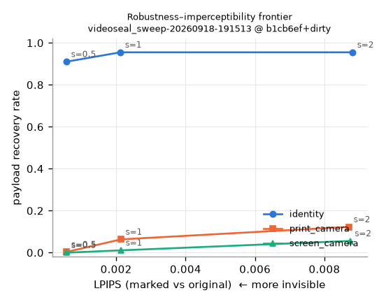
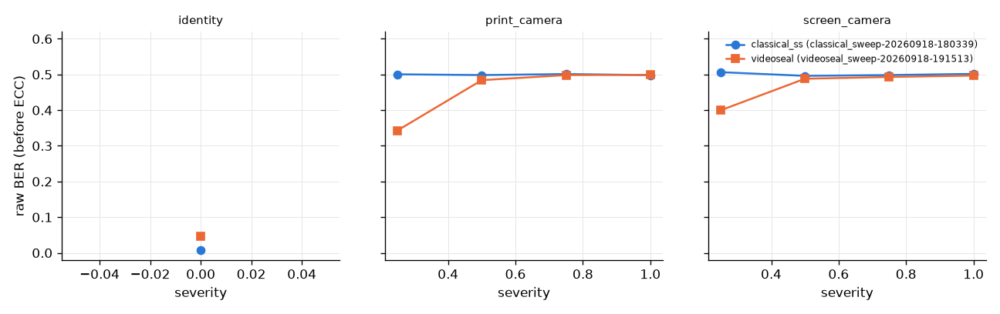
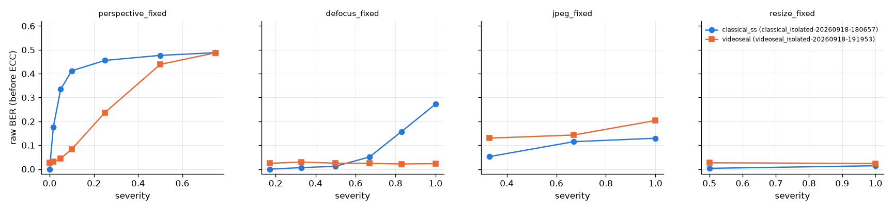

# Week 3 — Learned baseline (Video Seal 1.0) vs classical

**Status:** complete, 2026-09-18, branch `week3-videoseal`. Runs `videoseal_sweep-20260918-191513`
(3,618 rows) and `videoseal_isolated-20260918-191953` (2,412 rows), compared against the Week-2
classical runs with `pm-compare` (both from `summary.json`). RTX 3050; embed 25 ms, decode 20 ms
at 512².

Same corpus (67 images), same chains and severities, **same 64-bit message and inner code**
(BCH(127,64)) as Week 2; the 256-bit learned channel carries two soft-combined copies of the
codeword. Strength 1.0 is the model's own default (`scaling_w = 0.2`); 0.5 and 2.0 bracket it.

## TL;DR

1. **The perspective cliff moved from 1° to ~15°.** Video Seal's extractor (trained with
   geometric augmentation, no explicit rectifier) keeps raw BER ≤ 5 % to 3° tilt, ~8 % at 6°,
   24 % at 15 °, and is dead by 30 °. Classical was dead at 3 °. That is real progress and still
   an order of magnitude short of the brief's ±45° / 2 m envelope.
2. **Both camera channels still fail** at severity ≥ 0.5 (BER ≈ 0.5, recovery 0). At severity
   0.25 Video Seal recovers 25 % of payloads (46 % at strength 2, 70 % on photos); classical 0 %.
   Perspective dominates: the channel's ≤ 15° tilt/yaw at 0.25 is right at the cliff.
3. **It is far more invisible.** PSNR 45.4 dB / LPIPS 0.003 on photos at strength 1 (published
   SA-V: 45.75 / 0.003 — reproduced), 61 dB on flat fills; classical at s=1 was 32–37 dB /
   LPIPS 0.2–0.6.
4. **The flat-image JPEG failure recurs, and is worse.** At Q75, flat 49 % BER (classical 33 %),
   gradient 32 %, text 19 %, photo 0.6 %. Its JND attenuation shrinks the mark on smooth regions
   below the quantiser step — the same mechanism as Watson. Two independent perceptual budgets,
   one failure: **a perceptual budget without a channel noise floor is not a capacity.**
5. **Out-of-distribution textures break it.** Procedural white noise / checkerboard / noise-on-
   gradient images sit at 13–24 % BER even with no distortion (5 of 8 textures recover, at every
   strength). A provenance model trained on photographs is not a general-media model.

## Fidelity and the digital channel (identity, per class × strength)

| class | s=0.5 BER / rec / PSNR / LPIPS | s=1.0 | s=2.0 |
|---|---|---|---|
| flat | 0.033 / 1.00 / 67.5 / 0.0000 | 0.014 / 1.00 / 61.5 / 0.0001 | 0.003 / 1.00 / 55.3 / 0.0006 |
| gradient | 0.050 / 1.00 / 66.1 / 0.0001 | 0.022 / 1.00 / 59.8 / 0.0005 | 0.010 / 1.00 / 53.9 / 0.0032 |
| text | 0.093 / 0.80 / 52.2 / 0.0001 | 0.014 / 1.00 / 46.2 / 0.0003 | 0.000 / 1.00 / 40.2 / 0.0014 |
| textured | 0.238 / 0.63 / 51.7 / 0.0004 | 0.159 / 0.63 / 45.7 / 0.0016 | 0.130 / 0.63 / 39.7 / 0.0072 |
| photo | 0.092 / 0.95 / 51.4 / 0.0008 | **0.002 / 1.00 / 45.4 / 0.0031** | 0.000 / 1.00 / 39.4 / 0.0126 |

Note the inversion relative to classical: here *flat* images get the highest PSNR (the JND
attenuation nearly zeroes the mark there) and still decode on the clean channel because the
extractor is sensitive — but that same tiny mark is what JPEG erases (below).



## Camera channels

Raw BER (strength-averaged) and payload recovery, classical vs Video Seal:

| chain | sev | classical BER / rec | Video Seal BER / rec | Video Seal @ s=2 rec |
|---|---|---|---|---|
| print_camera | 0.25 | 0.501 / 0.00 | **0.343 / 0.24** | 0.46 (photo 0.70, text 0.20, flat 0.00) |
| print_camera | 0.50 | 0.498 / 0.00 | 0.484 / 0.01 | 0.03 |
| print_camera | ≥0.75 | 0.50 / 0.00 | 0.50 / 0.00 | 0.00 |
| screen_camera | 0.25 | 0.507 / 0.00 | **0.400 / 0.08** | 0.19 |
| screen_camera | ≥0.50 | 0.50 / 0.00 | ≥0.48 / ≤0.01 | 0.03 |



## Isolated axes (strength 1.0)



**Perspective (tilt), raw BER per class:**

| tilt | flat | gradient | photo | text | textured | classical (all) |
|---|---|---|---|---|---|---|
| 0° | 0.009 | 0.042 | 0.002 | 0.020 | 0.171 | 0.000 |
| 1° | 0.019 | 0.009 | 0.004 | 0.034 | 0.187 | 0.176 |
| 3° | 0.018 | 0.025 | 0.021 | 0.054 | 0.201 | 0.335 |
| 6° | 0.049 | 0.048 | 0.057 | 0.123 | 0.249 | 0.412 |
| 15° | 0.211 | 0.188 | 0.209 | 0.259 | 0.425 | 0.456 |
| 30° | 0.401 | 0.361 | 0.451 | 0.419 | 0.482 | 0.477 |
| 45° | 0.480 | 0.479 | 0.492 | 0.477 | 0.484 | 0.488 |

Payload recovery: 96 % to 3°, 93 % at 6°, 37 % at 15°, 0 at 30°. Presence AUC stays 0.94 at 15°
and 0.84 at 30° (the message-energy statistic degrades more gracefully than the bits).

**JPEG, raw BER per class:**

| Q | flat | gradient | photo | text | textured |
|---|---|---|---|---|---|
| 75 | **0.493** | 0.321 | 0.006 | 0.187 | 0.185 |
| 50 | 0.441 | 0.398 | 0.020 | 0.233 | 0.205 |
| 25 | 0.490 | 0.438 | 0.085 | 0.263 | 0.294 |

**Defocus:** flat on ~2.5 % up to σ = 3 px (classical: 27 % at 3 px). Video Seal embeds at 256 px
and upsamples, so its mark lives at low spatial frequencies that blur does not touch — and that
JPEG's low-frequency quantiser steps *do*. **Resize:** benign for both.

## False-positive accounting

0 false payload recoveries in 1,809 + 1,206 control trials. Presence score (mean |logit|) on
unmarked images: mean 0.39, sd 0.28, max 1.74; on marked identity images ≈ 11. A threshold of 2
would give an empirical per-frame FPR < 1/3,000 with 100 % TPR on the clean channel — same
caveat as Week 2: the 10⁻⁸ scanning target needs a multi-frame protocol, not a single threshold.

## What this means for the plan

1. **Week-4 gate is now a real question.** At severity 0.25 (≤ 15° tilt/yaw, mild blur/JPEG) the
   learned baseline recovers 70 % of photos at strength 2 with LPIPS 0.013. The brief's gate —
   64 bits at ≥ 90 % at 1 m / 30° — is not met in simulation, but it is within reach of a
   synchronisation fix rather than hopeless. Physical captures decide.
2. **Branch A (synchronisation) is confirmed as the binding constraint** for *both* marker
   families on textured media. The learned extractor buys ~15° for free; ±45° needs an explicit
   rectifier (STN / pilot + homography) in front of it.
3. **Branch B (budget/refusal) is confirmed as a separate, real problem** for flat media: two
   different perceptual attenuations both push flat-region marks under the JPEG floor. Any
   capacity estimator must be `min(perceptual budget, channel floor)` per region, and a solid
   fill should be refused, not weakly marked. Video Seal's *always-emit* behaviour on flat images
   is a demonstration of exactly the failure mode the brief calls out.
4. **Corpus lesson:** the procedural `textured` class is out of distribution for a photo-trained
   model. Keep it — it is the honest stress test — but report it separately from `photo`.
5. **Do not fine-tune Video Seal on our channel yet.** Its 256-px processing resolution and
   luma-only embedder are architectural choices; the Week-4 data should decide whether to adapt
   it or train with our simulator from the StegaStamp recipe.

## Reproduction

```
uv sync --extra videoseal
uv run pm-run configs/experiments/videoseal_sweep.yaml      # ~10 min on RTX 3050
uv run pm-run configs/experiments/videoseal_isolated.yaml   # ~5 min
uv run pm-compare outputs/<classical_run> outputs/<videoseal_run>
```
