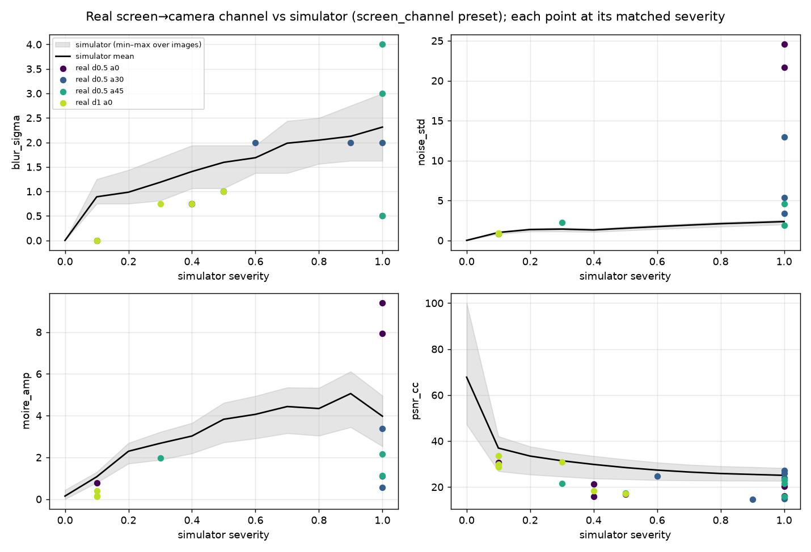

# Week 4a — The real screen→camera channel vs the simulator

**Status:** complete, 2026-09-19, branch `week4-capture`. Capture set `screen_calib_20260919`
(external root): 24 phone photos of 6 *unmarked* corpus images shown 1:1 on a 27" 1080p BenQ GW2790,
Nothing Phone (2a) main camera, office room light, 0.5 m × {0°, 30°, 45°} + 1 m × 0°.
Tools: `pm-capture log`, `pm-capture channel` (`docs/capture_protocol.md`). Simulator side:
`screen_channel` preset (= `screen_camera` minus perspective), severities 0–1 in 0.1 steps, 4
seeds per image.

## TL;DR

1. **Localisation and pose work on all 24 captures** using the monitor as the fiducial:
   reprojection error < 5 px, and the by-eye conditions were good — "0°" measured 2–5°, "30°"
   29–34°, "45°" 45–49°; "0.5 m" ≈ 0.48–0.54 m, "1 m" ≈ 0.81 m (27" pitch, 0.311 mm).
2. **The simulator's screen chain cannot reach the real head-on channel.** At 0.5 m / 0° the
   flat fills carry 22–25 grey levels of high-frequency residual with a dominant periodic
   component of amplitude 8–9 (colour moiré from the phone's Bayer CFA beating with the panel's
   subpixels at 3.7 camera px per image px). `screen_channel` at severity **1** produces
   noise ≈ 2.4 and moiré ≈ 4. Its `Moire` stage samples at 0.6–1.4 sensor px per display px with
   no colour filter array — the wrong regime for a phone at arm's length.
3. **The real channel is not monotone in one "severity".** Moiré and noise collapse with distance
   (1 m: residual 0.9, moiré 0.2 — *milder* than the sim at severity 0.1) and with angle (45°:
   2.9 / 1.8), while blur grows with angle (σ 0.6 → 1.6 → 2.1 px for 0°/30°/45°, foreshortening).
   The condition ↔ severity match is therefore per mechanism, not one number:

   | condition (nominal) | measured | matched severity (mean, range over 6 images) | what drives it |
   |---|---|---|---|
   | 0.5 m / 0° | 0.48 m, 3° | 0.57 (0.1–1.0) | flats pinned at 1.0 by moiré the sim can't reach; textured 0.4 |
   | 0.5 m / 30° | 0.53 m, 32° | 0.92 (0.6–1.0) | blur 1.6 px + residual moiré |
   | 0.5 m / 45° | 0.54 m, 48° | 0.80 (0.3–1.0) | blur 2.1 px; moiré gone |
   | 1 m / 0° | 0.81 m, 2° | **0.25** (0.1–0.5) | mild everything |

4. **The phone's tone curve matters more than its noise** for most classes. A per-channel
   tone-curve fit (not gain/offset) is what makes the comparison fair: it lifts textured from
   22.6 → 30.7 dB and the gradient from 29 → 33.6 dB. What remains after the tone curve is
   spatial: sharpening/local contrast on the photo (18 dB at full res, 25 dB at ¼ res, 1 m head-on)
   — the sim has no sharpening stage.
5. **Exposure.** With tap-to-expose the camera still put mid-grey at ≈ 215 and clipped the radial
   vignette's centre (`clip_frac` up to 0.5 on brand-blue at 1 m). Two of the six images lose
   information in the capture before any decoder sees them.

## Figures

*Reference (left) and the rectified capture at each condition. Colour moiré at 0.5 m head-on on
the flat, blue and noise images; nearly gone at 30°/45° and at 1 m.*

*Simulator statistics vs severity (grey band: min–max over the six images) with each real capture
plotted at its matched severity. Top right: real head-on noise (22–25) is off the simulator's
scale (≤ 2.4). Bottom left: same for moiré amplitude (8–9 vs ≤ 5).*

## Numbers

Real captures, mean over the images that carry each statistic (noise/moiré/shading on the ≥ 90 %
flat classes only; blur on the textured classes):

| condition | angle | dist | px/px | blur σ | noise | moiré amp | PSNR_cc | SSIM_cc | LPIPS_cc |
|---|---|---|---|---|---|---|---|---|---|
| 0.5 m / 0° | 3.3° | 0.48 | 3.69 | 0.62 | 15.7 | 6.0 | 20.2 | 0.43 | 0.52 |
| 0.5 m / 30° | 31.6° | 0.53 | 3.14 | 1.62 | 7.2 | 1.7 | 21.9 | 0.60 | 0.43 |
| 0.5 m / 45° | 47.7° | 0.54 | 2.84 | 2.12 | 2.9 | 1.8 | 20.4 | 0.75 | 0.26 |
| 1 m / 0° | 2.5° | 0.81 | 2.20 | 0.62 | 0.9 | 0.2 | 26.4 | 0.86 | 0.15 |

Simulator (`screen_channel`, mean over the same six images):

| severity | blur σ | noise | moiré amp | PSNR_cc | SSIM_cc | LPIPS_cc |
|---|---|---|---|---|---|---|
| 0.1 | 0.89 | 1.00 | 1.1 | 36.9 | 0.94 | 0.22 |
| 0.3 | 1.19 | 1.42 | 2.7 | 31.4 | 0.81 | 0.43 |
| 0.5 | 1.59 | 1.53 | 3.8 | 28.5 | 0.71 | 0.52 |
| 1.0 | 2.31 | 2.36 | 4.0 | 25.1 | 0.60 | 0.60 |

Per class, PSNR after the tone curve (dB): photo 15–18 at every condition, text 15–17, textured
21–31, flat 18–29, gradient 23–34. The photo and text numbers do not improve with distance:
their residual is the phone's sharpening/local contrast and ~1–3 px of residual registration,
not blur or noise.

## What this means for the go/no-go and for Week 5

- The Week-2/3 sweeps ran the simulator to severity 1 and called it the physical channel. For
  **1 m head-on** that over-states the channel (real ≈ severity 0.25); for **0.5 m head-on** it
  under-states the moiré by 4–10×. Any decode result at 0.5 m / 0° in the coming marked-capture
  round should be read against that.
- The **gate's condition (1 m / 30° / mixed light)** was not in this set: extrapolating, ~1 m
  brings noise/moiré down to the sim's 0.1–0.3 band while 30° keeps blur at ~1.5 px, so the
  expected regime is sim severity 0.3–0.5 *plus* a perspective the sim already covers. The decode
  round will include 1 m / 30° directly.
- **Simulator fixes if Branch A is chosen:** (i) `Moire` needs a CFA-aware sampling regime at
  2–4 sensor px per display px (the phone regime), which is where the big colour moiré comes
  from; (ii) a sharpening / local-contrast stage; (iii) illumination should include a per-channel
  tone curve rather than gain/gamma only. None of these change the geometric story, which is what
  Week 2/3 measured.
- **For Branch B:** two of six images clipped in capture (vignette centre, brand blue at 1 m) —
  the capacity estimator's channel term needs the *camera's* exposure behaviour, not only the
  eye's; that is a third piece of evidence for "budget ≠ capacity".

## Honest limits

- One rig, one room, one phone, six images. The by-eye distances are consistent (0.48–0.54 m
  for "0.5 m", 0.81 m for "1 m"); the panel is a 27" GW2790 (pitch 0.311 mm) — the angles are
  size-free, the distances scale with the pitch.
- Residual registration after rectification is 1–3 px at the corners (ECC check); it costs 1–3 dB
  on textured content and is included in the reported PSNR_cc. The decode round does not depend
  on it (the decoder receives the rectified image either way).
- Noise/moiré statistics are trusted only on the flat and gradient classes; on the text poster the
  phone's sharpening halos leak into the flat mask (`MIN_FLAT_FRAC = 0.9`).
- `illum_range` on the gradient class measures the gradient itself; only the flat class's value
  (≈ 0.05–0.35) is the channel's shading.
